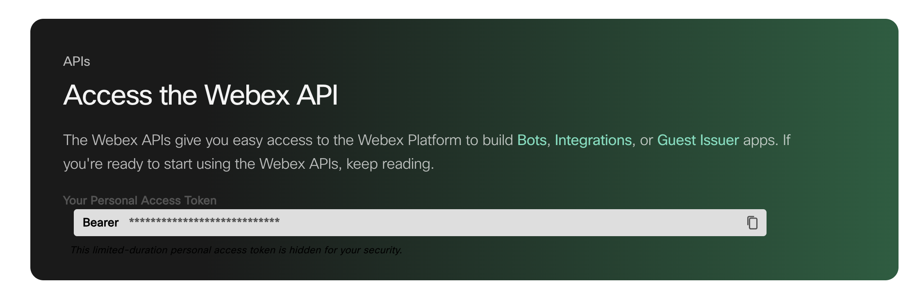

# Cisco Webex Utilities

A collection of PowerShell scripts to help manage and query Cisco Webex devices.

## Get-Devices Script

This script fetches and displays information about Cisco Webex devices using the Webex API.

### Features

- Secure handling of your Webex API token
- Cross-platform support (Windows, macOS, Linux)
- Tabular display of device information
- Optional CSV export of complete device data

### Prerequisites

- PowerShell 5.1 or higher
  - Windows: Built-in
  - macOS/Linux: Install [PowerShell Core](https://github.com/PowerShell/PowerShell#get-powershell)
- A Webex Personal Access Token ([Get one here](https://developer.webex.com/docs/api/getting-started))

### Quick Start

You can run this script directly from GitHub without downloading it:

#### Windows PowerShell
```powershell
Invoke-Expression (Invoke-WebRequest -Uri "https://raw.githubusercontent.com/lecabit/Cisco-Webex-ControlHub-API-Powershell/main/Get-Devices.ps1" -UseBasicParsing).Content
```

#### PowerShell Core (Windows, macOS, Linux)
```powershell
Invoke-Expression (Invoke-RestMethod -Uri "https://raw.githubusercontent.com/lecabit/Cisco-Webex-ControlHub-API-Powershell/main/Get-Devices.ps1")
```

### Manual Download and Execution

1. Download the script:
   ```powershell
   Invoke-WebRequest -Uri "https://raw.githubusercontent.com/lecabit/Cisco-Webex-ControlHub-API-Powershell/main/Get-Devices.ps1" -OutFile "Get-Devices.ps1"
   ```

2. Run the script:
   ```powershell
   ./Get-Devices.ps1
   ```

### Usage Instructions

1. When prompted, enter your Cisco Webex Personal Access Token
   - Your token is handled securely and will never be stored
   - You can generate a token at [developer.webex.com](https://developer.webex.com/docs/api/getting-started)
   
   
   

2. The script will fetch and display your devices in a table format

3. You'll be asked if you want to export the complete device data to a CSV file
   - Default is Yes (just press Enter)
   - The CSV will be saved to your Documents folder (or Desktop on macOS)

### Troubleshooting

- **Authentication Error**: Verify your access token is correct and hasn't expired
- **No Devices Found**: Confirm your Webex account has associated devices
- **Script Execution Policy**: If you get a security error, you might need to adjust your execution policy:
  ```powershell
  Set-ExecutionPolicy -ExecutionPolicy Bypass -Scope Process
  ```

### License

MIT
